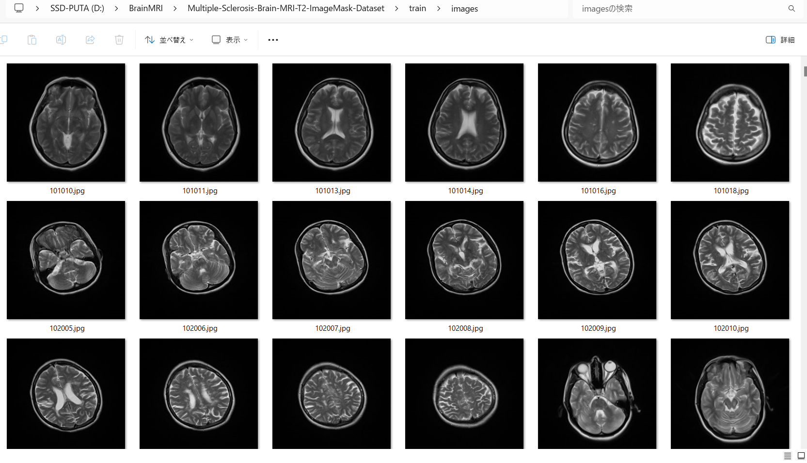
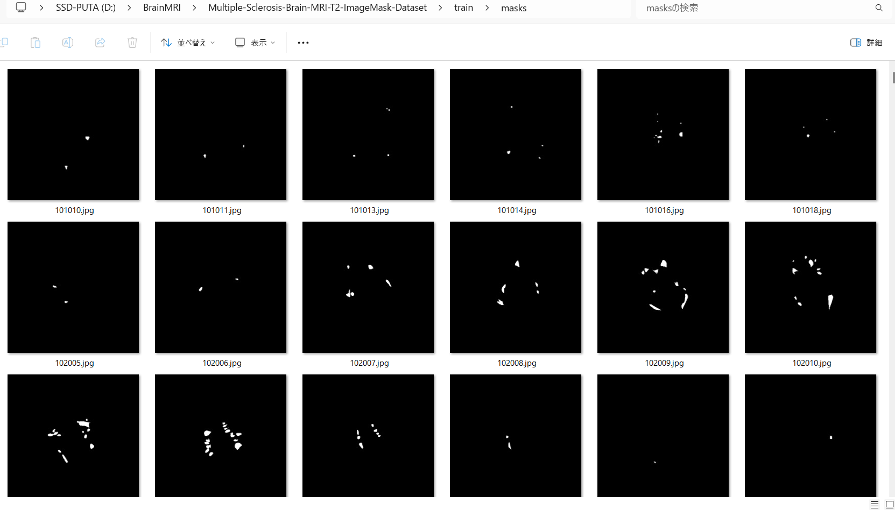
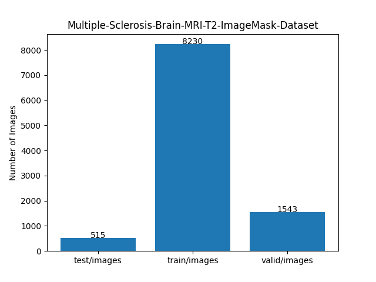
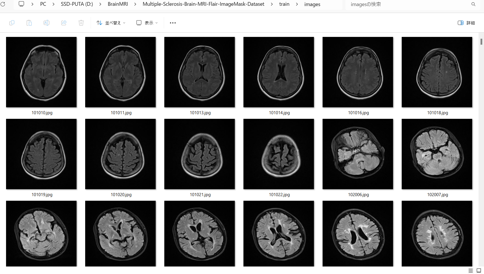
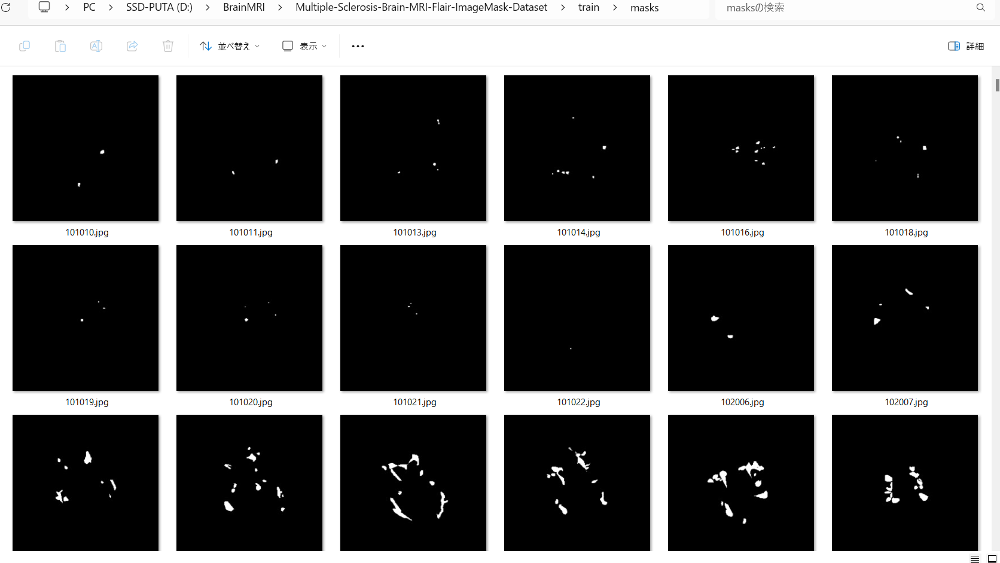

<h2>ImageMask-Dataset-Multiple-Sclerosis-Brain-MRI  (Updated: 2024/09/13)</h2>
<li>2024/09/13: Added Multiple-Sclerosis-Brain-MRI-Flair-ImageMask-Dataset.</li>
 
This is ImageMask Dataset for <a href="https://data.mendeley.com/datasets/8bctsm8jz7/1">
Brain MRI Dataset of Multiple Sclerosis with Consensus Manual Lesion Segmentation and Patient Meta Information. 
</a>
 
  
<b>Download T2 ImageMask-Dataset</b> 
You can download 
<a href="https://drive.google.com/file/d/1lnwZ_lQ9OUBUkEHsJBVZScmLSBk8Obsk/view?usp=sharing">
Multiple-Sclerosis-Brain-MRI-T2-ImageMask-Dataset.zip</a>
, which was derived by us from the original Multiple-Sclerosis-Brain-MRI,
 
  
<b>Download Flair ImageMask-Dataset</b> 
You can download <a href="https://drive.google.com/file/d/1Wf3O5At5VJjxCY995ubh_OGptqdJTuQ0/view?usp=sharing">
Multiple-Sclerosis-Brain-MRI-Flair-ImageMask-Dataset.zip</a>
, which was derived by us from the original Multiple-Sclerosis-Brain-MRI,
 
 
<h3>1. Dataset Citation</h3>
We used the following dataset to create our ImageMask dataset 
<a href="https://data.mendeley.com/datasets/8bctsm8jz7/1">
Brain MRI Dataset of Multiple Sclerosis with Consensus Manual Lesion Segmentation and Patient Meta Information 
</a>
 
Published: 31 March 2022|Version 1|DOI:10.17632/c
 

<b>Contributor:</b>Ali M Muslim
 
<b>Description</b> 
Magnetic resonance imaging (MRI) provides a significant key to diagnose and monitor the progression of Multiple Sclerosis (MS) disease. Manual MS-Lesion segmentation, Expanded Disability Status Scale (EDSS) and patient’s meta information can provide a gold standard for research in terms of automated MS-lesion quantification, automated EDSS prediction and identification of the correlation between MS-lesion and patient disability. In this dataset, we provide a novel multi-sequence MRI dataset of 60 MS patients with consensus manual lesion segmentation, EDSS, general patient information and clinical information. On this dataset, three radiologists and neurologist experts segmented and validated the manual MS-lesion segmentation for three MRI sequences T1-weighted, T2-weighted and fluid-attenuated inversion recovery (FLAIR). The dataset can be used to study the relationship between MS-lesion, EDSS and patient clinical information. Furthermore, it also can be used to development of automated MS-lesion segmentation, patient disability prediction using MRI and correlation analysis between patient disability and MRI brain abnormalities include MS lesion location, size, number and type. 
 
<b>Licence</b> CC BY 4.0 
 

<h3>2. Download Multiple-Sclerosis-Brain-MRI Dataset</h3>
Please download the original dataset from 
<a href="https://data.mendeley.com/datasets/8bctsm8jz7/1">
Brain MRI Dataset of Multiple Sclerosis with Consensus Manual Lesion Segmentation and Patient Meta Information 
</a>
 
It contains the following Flair, T1, and T2 nii files for 60 patients.  
<pre>
./8bctsm8jz7-1
├─Patient-1
│  ├─1-Flair.nii
│  ├─1-LesionSeg-Flair.nii
│  ├─1-LesionSeg-T1.nii
│  ├─1-LesionSeg-T2.nii
│  ├─1-T1.nii
│  └─1-T2.nii
├─Patient-2
│  ├─2-Flair.nii
│  ├─2-LesionSeg-Flair.nii
│  ├─2-LesionSeg-T1.nii
│  ├─2-LesionSeg-T2.nii
│  ├─2-T1.nii
│  └─2-T2.nii
...
└─Patient-60
   ├─60-Flair.nii
   ├─60-LesionSeg-Flair.nii
   ├─60-LesionSeg-T1.nii
   ├─60-LesionSeg-T2.nii
   ├─60-T1.nii
   └─60-T2.nii

</pre>

<h3>3. Generate T2 ImageMaskDataset </h3>

Please run the following command for Python script <a href="./ImageMaskDatasetGenerator.py">ImageMaskDatasetGenerator.py</a>.
 
<pre>
> python ImageMaskDatasetGenerator.py T2
</pre>
You can specify dataset type as a command line parameter: Flair, T1, and T2. 
<pre>
 python ImageMaskDatasetGenerator.py [Flair|T1|T2]
</pre>
This command will generate augmented 512x512 jpg image and mask datasets of T2. 

<pre>
./Multiple-Sclerosis-Brain-MRI-master-T2
├─images
└─masks
</pre>
The genetor script <a href="./ImageMaskDatasetGenerator.py">ImageMaskDatasetGenerator.py</a> is 
really an offline dataset augmentation tool, which supports the following image transformation operations. 
<pre>
hflip 
deformation
distortion
barrel_distortion
pincushion_distortion
</pre>

 
<h3>4. Split T2 master</h3>
Please run the following command for Python script <a href="./split_master.py">split_master.py</a>.
 
<pre>
> python split_master.py T2
</pre>
This command will generate test, train and valid subsets from Multiple-Sclerosis-Brain-MRI-master-T2. 
<pre>
./Multiple-Sclerosis-Brain-MRI-T2-ImageMask-Dataset
├─test
│  ├─images
│  └─masks
├─train
│  ├─images
│  └─masks
└─valid
    ├─images
    └─masks
</pre>

<b>train images sample</b> 

 

<b>train masks sample</b> 

 
<b>Dataset Statistics</b> 

 
<!--
 -->
 
<h3>5. Generate Flair ImageMaskDataset </h3>

Please run the following command for Python script <a href="./ImageMaskDatasetGenerator.py">ImageMaskDatasetGenerator.py</a>.
 
<pre>
> python ImageMaskDatasetGenerator.py Flair
</pre>
This command will generate augmented 512x512 jpg image and mask datasets of Flair. 

<pre>
./Multiple-Sclerosis-Brain-MRI-master-Flair
├─images
└─masks
</pre>

 
<h3>6. Split Flair master</h3>
Please run the following command for Python script <a href="./split_master.py">split_master.py</a>.
 
<pre>
> python split_master.py Flair
</pre>
This command will generate test, train and valid subsets from Multiple-Sclerosis-Brain-MRI-master-Flair. 
<pre>
./Multiple-Sclerosis-Brain-MRI-Flair-ImageMask-Dataset
├─test
│  ├─images
│  └─masks
├─train
│  ├─images
│  └─masks
└─valid
    ├─images
    └─masks
</pre>

<b>train images sample</b> 

 

<b>train masks sample</b> 

 
<b>Dataset Statistics</b> 

 

<b>References</b> 

<b>1. Brain MRI dataset of multiple sclerosis with consensus manual lesion segmentation and patient meta information</b> 
Ali M. Muslim, Syamsiah Mashohor, Gheyath Al Gawwam, Rozi Mahmud, Marsyita binti Hanafi, 
Osama Alnuaimi, Raad Josephine, Abdullah Dhaifallah Almutairi 
https://doi.org/10.1016/j.dib.2022.108139 

<a href="https://www.sciencedirect.com/science/article/pii/S235234092200347X">https://www.sciencedirect.com/science/article/pii/S235234092200347X</a>
 
 
<b>2. Multiple Sclerosis Lesion Segmentation in Brain MRI Using Inception Modules Embedded in a Convolutional Neural Network</b> 

Shahab U. Ansari, Kamran Javed, Saeed Mian Qaisar, Rashad Jillani, Usman Haider 
First published: 04 August 2021 https://doi.org/10.1155/2021/4138137 
<a href="https://onlinelibrary.wiley.com/doi/10.1155/2021/4138137?msockid=3ec756cfd5d167d7342f47c9d4de66ff">https://onlinelibrary.wiley.com/doi/10.1155/2021/4138137?msockid=3ec756cfd5d167d7342f47c9d4de66ff</a>

